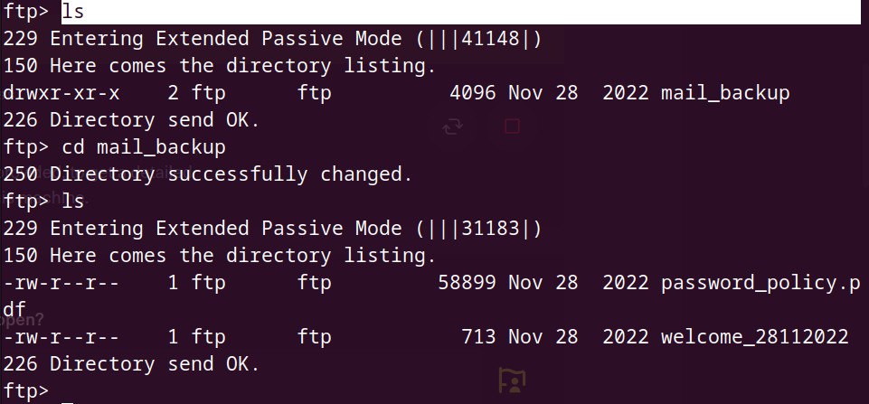
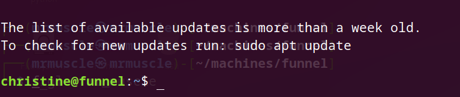
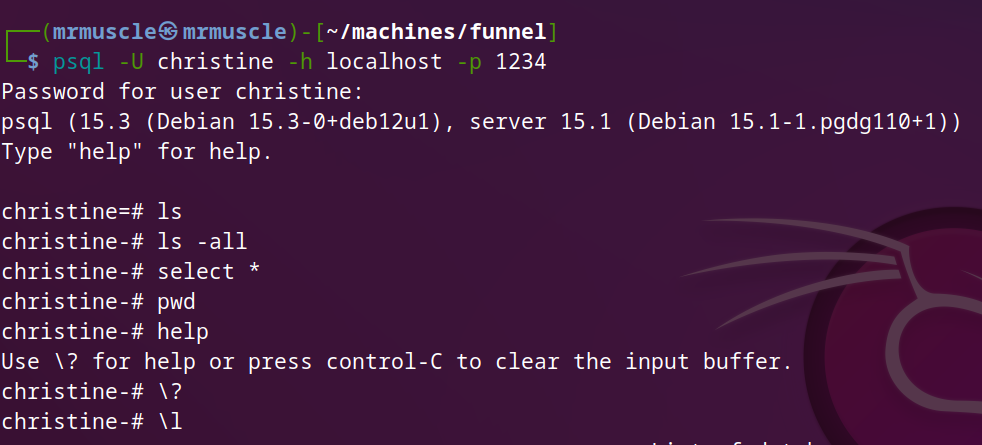

# Basics of penetration testing

***In our journy to learn penetration testing we takes a machines in HTB to can explain the basics of penetration***

## funnel Write-up

- After connecting with vpn you will spawn the machine and you will have the ip address for this machine .

- As we explained in earlier machines you must know how to download vpn and connect with HTB server and ping for IP_address .

### The idea of this machine is : see the following

- `FTP service`
- `Anonymous login`
- `SSH service`
- `Tunneling`
- `Database`
- `Postgresql`
- `Remote connection`
- when you reach the tunneling step you should understand the following very well because this is the most important section in the write-up , don't pay attention to this now and skip to begin with enumeration and you will understand the following later:-
  
  - We have port `5432/tcp` in the target machine and we can't use the `postgresql` which running on this port ,we can't use this database bacause we need to download some tools and we can't do that inside the target machine because we don't have the permission so , we will do something called Tunneling and this in very simple way like following: `we will make any random local port from our local machine listen to the 5432 port in the target machine` , after that when we do any action to our local port this will lead us to make change in the target port

### Enumeration :-

***And this is the first step you will begin with every time you performing an attack***

- we will begin with `nmap` tool to check what is the open ports in the target machine .

- we will use this command `sudo nmap -sC -sV -A {IP_address}` , in the next image you can study what this command do.
- 

- In the next image you will see the output of nmap tool :-

- 
  
- As you can see in the `nmap report` we got two open ports :-
  
  - `21/tcp` : open
    - service : `ftp`  
    - version : `vsftpd 3.0.3`
    - And we can see that the `Anonymous FTP login allowed` , and this is very important information in our attack.
    - Also we can see the `mail_backup` directory in ftp ,which mean if we successfully connected with ftp protcol then we we can reach the `mail_backup` directory.
  - `22/tcp` :  open
    - service : `ssh`  
    - version : `openssh 8.2p1`

- Also we can see the `mail_backup` directory in ftp .
  
  - which mean if we successfully connected with ftp protcol then we we can reach the `mail_backup` directory.

- So let's try to connect with `ftp`.
  
  - To conect with `ftp` you need to `{USERNAME, PASSWORD}` , and we know from `nmap report` that the user_name is `anonymous` and when you search about anonymous login you will know that the default password for anonymous is nothing which mean you will skip the password by clicking `enter` without any character.

- To connect with `ftp` you need to type `ftp {target_IP}`

- 

- As you can see in the previous image i loged in with `anonymous login`.
  
  - user_name : `anonymous`
  - password : `blank` which mean nothing just click enter

- 

- Now we are in let's discover `what is here?`

- 

- we find direcotry called `mail_backup`, then we change directory to discover what inside this directory , and we find to files let's download them to our machine.

- 

- We successfully download the files inside our machine , let's open them.

- Go to your directory in your local machine and type `ls` as following.

- 

- Here , we downloaded two files `{password_policy.pdf , welcome_28112022}` , let's open them .

- 

- When you read the pdf you can see in the last line that the default password is `funnel123#!#` .
  - before we go , the idea here to use the default password soon.

- let's open the next file .

- 

- you can see that the file is typed to welcome the team , because we are so lucky we can collect usernames of the team from the second line.

  - optimus
  - albert
  - andreas
  - christine
  - maria

- Now we have the default password whcih is `funnel123#!#` and we have some user_names.
- so let's try to open with those usernames instead of the anonymous login.

- I will try all usernames with the default password to see if there is any member of the team isn't smart enough to change his password.

- 

- `andreas` gives me login incorrect so let's try another one.

- 

- user_name is `christine`  and the password is `funnel123#!#` and this turn gives me login successful so let's find what we will see inside the machine.

- when you login again with ftp you will find that you don't have any thing to attack or steal , so we need to use the user_name and the password we collected in hardest way .
- let's try to connect with ssh service , we will use this service because in `nmap report` we find that the `port22/tcp open and the service was ssh` .

- Now we will try to connect with `ssh` to intialize the connection type in your terminal `ssh christine@{target_IP}` , You will asked password you will use the default one `funnel123#!#` .

- 
- 

- We already connected with ssh , so we will try to search about any potential information can lead us to the flag file.
- so let's begin with `netstat` command .

- 

- `127.0.0.1` is synonymous with localhost , and essentially means that the specified port is only listening locally on the machine and cannot be accessed externally.
- This also explains
why we did not discover such ports in our initial Nmap scan. On the other hand, the addresses `0.0.0.0 , * ,` and `[::]` indicate that a port is listening on all intefaces, meaning that it is accessible externally, as well as locally, which is why we were able to detect both the FTP service on port 21 , as well as the SSH service on
port 22 .

- 

- Now we knwo what is the service running in the `5432` port which is `postgresql` which is a database
management system: creating, modifying, and updating databases, changing and adding data, and more.

- PostgreSQL can typically be interacted with using a command-line tool called psql .
- however, attempting to run this command on the target machine shows that the tool is not installed .
- And we don't have the permission to use this command inside the machine, as following.
- 

#### Tunneling

- SSH port forwarding is a mechanism in SSH for tunneling application ports from the client machine to the server machine, or vice versa.
- It can be used for adding encryption to legacy applications, going through firewalls, and some system administrators and IT professionals use it for opening backdoors into the internal network from their home machines.
- It can also be abused by hackers and malware to open access from the Internet to the internal network.
- there is different types of tunneling`{local forwarding , Remote Forwarding}` , we will use local forwarding in this write-up but you should know that we can also use `remote forwarding` but you can search about it separately .

- **Local forwarding** is used to forward a port from the client machine to the server machine. Basically, the SSH client listens for connections on a configured port, and when it receives a connection, it tunnels the connection to an SSH server. The server connects to a configurated destination port, possibly on a different machine than the SSH server.

***just understand this point and you will understand all of the above***

- We have port `5432/tcp` in the target machine and we can't use the `postgresql` which running on this port ,we can't use this database bacause we need to download some tools and we can't do that inside the target machine because we don't have the permission so , we will do something called Tunneling and this in very simple way like following: `we will make any random local port from our local machine listen to the 5432 port in the target machine` , after that when we do any action to our local port this will lead us to make change in the target port .

- we will use this command to perform the tunnel `ssh -L 1234:localhost:5432 user@remote.example.com`

  - when you run this command, the SSH client will establish a secure connection to the remote SSH server,and it will listen for incoming connections on the local port 1234 .
  - When a client connects to the local port,
the SSH client will forward the connection to the remote server on port 5432 .
  - This allows the local client to access services on the remote server as if they were running on the local machine.

##### foothold

- let's perform the tunnel and get the flag.
  
- 

- Now we successfully did the tunnel between our port and the target port.
- Let's check it out from our machine.

- 

- Now you should understand , I made a nmap scan to our local port `1234` and the runninng service is `postgresql` and this is the same service running in the terget machine which mean that I successfully connect the two ports with each other.
- In the next image you can see that SSH has opened up a socket on our local machine on `port 1234`.

- which we can now direct traffic that we want forwarded to port 5432 on the target machine. We can see this new socket by running `ss` again, but this time on our local machine, using a different shell than the one we used to establish the tunnel.
- 

***last step to get the flag***

- Dealing with database , you need to download the database in your local host , you can execute this command `sudo apt update && sudo apt install psql`.

- then you will use the next command to get in .

- 

- when you get the help menu you will notice that we will use the `\l` command to list the tables inside the databas.
  
- 

- you will find the flag inside the secrets table , so we need to list it .
  
- 

- Now we wil read the data inside the flag.
- be more specific about the syntax.

- 

- We successfully got the flag!
- Congratulations , Assem_Ayman.
